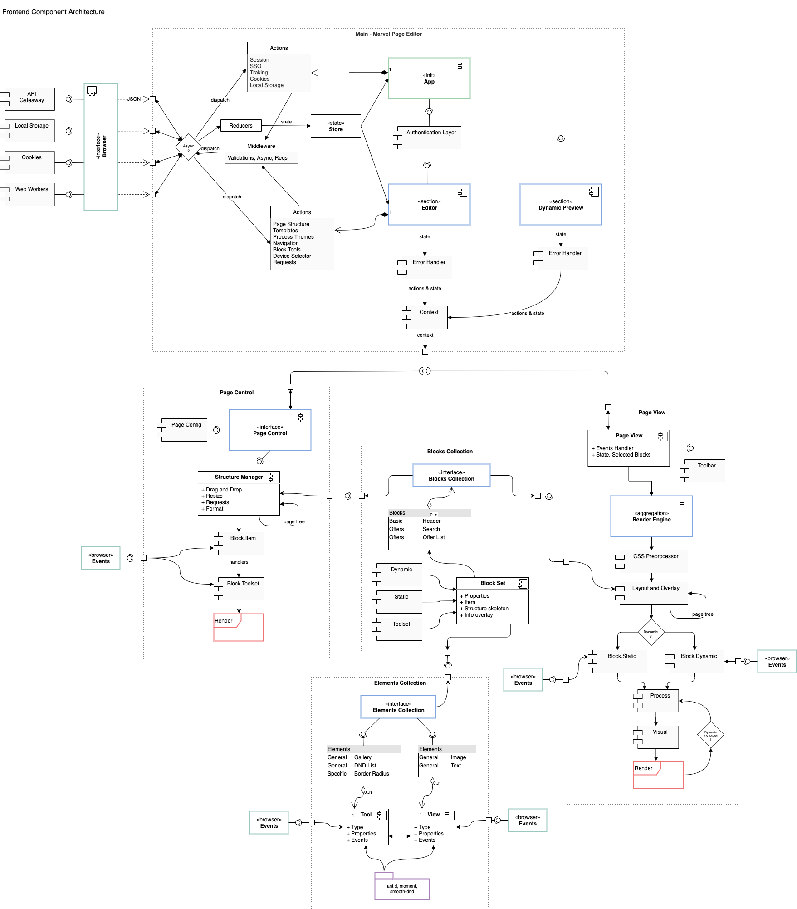

# Arz - Single Page Application (Base)
Boilerplate for implement a Single Page Application, with React, Redux, User Components, and some nice things! You will find more things that you need, so delete that unused code! :)

The following diagram attempts to explain from a relatively high level how part of the organization and logic of system components will be shaped. 

For state logic and component abstraction, Redux and React will be used. This architecture can be modified as the understanding of the requirements advances and the project matures.

The diagram is both declarative and flow chart, showing the layout and flow of the information. First of all, the system can be divided into 4 main parts, a **Main** where the global features are defined. This section can alter and give the current state of the app, provides methods to do this that will be consumed through the subscription to the Context by those who implement features that require it.

Within the **Page View** section, the rendering of the page that the user is building takes place. An abstraction called _Render Engine_ is in charge of transforming the object that represents the page (created from the JSON obtained from the API) into a web page. This component has two execution modes, one **static** and one **dynamic**, the first one will be the one chosen by the Page Editor since it will not execute asynchronous calls, nor obtain translations, nor react to end-user events, it will render a simplified version of the component and it will have the possibility to display the block overlay (an aid for customization with id's and css classes). Unlike the dynamic mode that must ensure that the page is functional and not instantiate anything regarding customization.

**Page Control** is a section that implements the "Left Pane", its capabilities allow you to modify the page through all kinds of tools obtained from the **Collections** (defined below) that will be instantiated according to what the current page and state requires. Components of this section such as the Structure Manager can trigger actions at the Editor level whose modifications in the store reach the Page View where the view is updated with the new information.

The fourth part can be divided in two, one is the **Block Collection**, where all the blocks that the user can select and use for the construction of the site are located. When you bring a type of block from the collection, what you get is a **Block Set** made up of the different "faces" of that block, according to where that block is being rendered it will render a different face, together with these "views" (not faces) we also have a _Properties_ object that has what is pertinent to the current instance of that block.

Each of the components that make up a **Block Set** is made up of other simpler components that we call **Elements**. These are in a structure similar to _Block Collection_ called **Elements Collection**. They can be divided first into _Tools_ and _Views_ (name open to suggestions), the Tools will be used to create the Toolset (the entire configuration tool of a block), and the Views are used to render the element in both static and dynamic modes.

